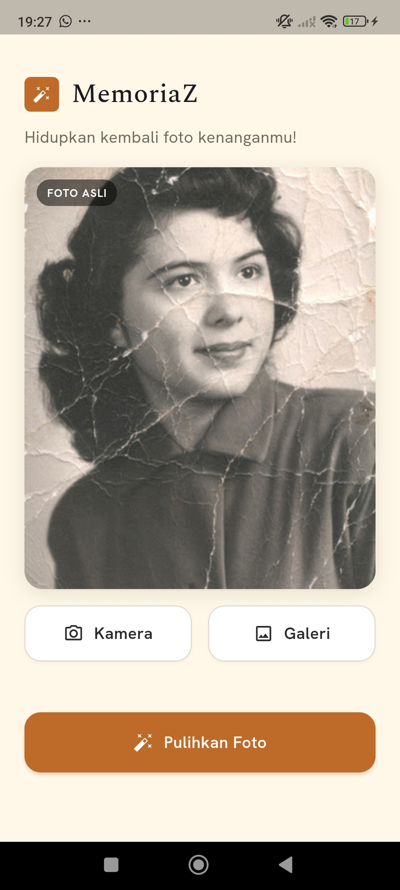
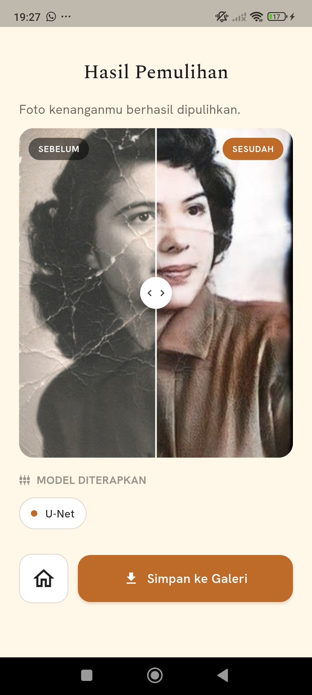

# MemoriaZ

> Hidupkan kembali foto kenanganmu. Aplikasi Flutter untuk **restorasi foto lama** menggunakan model deep learning (U-Net) yang berjalan di backend Python.

MemoriaZ membiarkan pengguna memilih/mengambil foto, mengirimnya ke backend untuk dipulihkan, lalu menampilkan perbandingan **sebelum vs sesudah** dengan slider interaktif dan menyimpan hasilnya ke galeri.

---

## Daftar Isi

- [Preview Aplikasi](#preview-aplikasi)
- [Fitur](#fitur)
- [Arsitektur](#arsitektur)
- [Backend](#backend)
- [Struktur Proyek](#struktur-proyek)
- [Prasyarat](#prasyarat)
- [Instalasi & Menjalankan](#instalasi--menjalankan)
- [Konfigurasi Koneksi Backend](#konfigurasi-koneksi-backend)
- [Build APK](#build-apk)
- [Troubleshooting](#troubleshooting)
- [Tech Stack](#tech-stack)

---

## Preview Aplikasi


<p align="center">
  
  &nbsp;&nbsp;
  
</p>

<p align="center">
  <em>Kiri: halaman utama &nbsp;•&nbsp; Kanan: hasil restorasi (slider before/after)</em>
</p>


---

## Fitur

- 📷 **Ambil foto** dari kamera atau pilih dari galeri.
- 🪄 **Restorasi foto** lewat backend Python (model U-Net).
- 🔀 **Slider before/after** interaktif untuk membandingkan foto asli dan hasil pemulihan.
- 💾 **Simpan ke galeri** hasil restorasi (album `MemoriaZ`).
- 🔐 **Manajemen izin** kamera, galeri, dan penyimpanan otomatis sesuai versi Android.

---

## Arsitektur

```
┌─────────────────────┐         HTTP (multipart)        ┌──────────────────────┐
│   MemoriaZ (Flutter)│ ───────  POST /restore  ──────▶ │  Backend Python       │
│                     │                                 │  (FastAPI + U-Net)    │
│   - pilih/ambil foto│ ◀──────  image/jpeg     ─────── │  - restorasi gambar   │
│   - tampilkan hasil │                                 │                       │
└─────────────────────┘                                 └──────────────────────┘
```

Aplikasi mengikuti pola **GetX** (State Management + Routing + Dependency Injection):

- **View** — UI murni (`*_view.dart`).
- **Controller** — logika & state reaktif (`*_controller.dart`).
- **Binding** — registrasi dependency per halaman (`*_binding.dart`).
- **Service** — komunikasi ke backend (`services/`).

---

## Backend

Backend **tidak** termasuk dalam repositori ini. Sumber dan instruksi setup ada di repo terpisah:

🔗 **Backend (FastAPI + U-Net):** https://github.com/jourdy-jr/Week-12---Cloud-Computing.git

Endpoint yang dipakai aplikasi:

| Method | Path        | Body                         | Response       |
|--------|-------------|------------------------------|----------------|
| `POST` | `/restore`  | `multipart/form-data` field `image` (file) | `image/jpeg` (foto hasil restorasi) |

Jalankan backend agar bisa diakses dari perangkat lain:

```bash
python -m uvicorn main:app --host 0.0.0.0 --port 8000
```

---

## Struktur Proyek

```
lib/
├── main.dart                       # Entry point, setup GetMaterialApp
└── app/
    ├── routes/
    │   ├── app_pages.dart           # Daftar halaman & binding
    │   └── app_routes.dart          # Konstanta nama rute
    ├── modules/
    │   ├── home/                    # Halaman utama: pilih foto & proses
    │   │   ├── bindings/
    │   │   ├── controllers/
    │   │   └── views/
    │   └── result/                  # Halaman hasil: before/after & simpan
    │       ├── bindings/
    │       ├── controllers/
    │       └── views/
    ├── services/
    │   └── image_restoration_service.dart   # Komunikasi HTTP ke backend
    └── widgets/                     # Komponen UI reusable
        ├── camera_button.dart
        ├── galery_button.dart
        ├── process_button.dart
        ├── result_card.dart         # Slider before/after
        └── ...
```

---

## Prasyarat

- **Flutter SDK** `^3.12.1` (Dart SDK termasuk).
- **Android device / emulator** (USB debugging aktif untuk perangkat fisik).
- **Backend Python** berjalan (lihat [Backend](#backend)).

---

## Instalasi & Menjalankan

```bash
# 1. Clone repositori
git clone <url-repo-ini>
cd memoriaz_app

# 2. Install dependency
flutter pub get

# 3. Jalankan backend (di mesin terpisah, lihat repo backend)
#    python -m uvicorn main:app --host 0.0.0.0 --port 8000

# 4. Atur baseUrl agar menunjuk backend (lihat bagian berikut)

# 5. Jalankan aplikasi
flutter run
```

---

## Konfigurasi Koneksi Backend

URL backend diatur di [`lib/app/modules/home/controllers/home_controller.dart`](lib/app/modules/home/controllers/home_controller.dart):

```dart
final ImageRestorationService _restorationService =
    ImageRestorationService(baseUrl: 'http://192.168.18.25:8000');
```

Pilih `baseUrl` sesuai skenario:

| Skenario | `baseUrl` | Catatan |
|----------|-----------|---------|
| **Emulator Android** | `http://10.0.2.2:8000` | Alias khusus emulator menuju `localhost` PC. |
| **HP fisik, WiFi sama** | `http://<IP-LAN-PC>:8000` | Cek IP via `ipconfig` (IPv4). HP & PC harus satu jaringan. Bisa gagal jika WiFi punya _client isolation_. |
| **HP fisik via USB** | `http://127.0.0.1:8000` | Jalankan `adb reverse tcp:8000 tcp:8000`. Tidak bergantung jaringan — paling andal untuk demo. |
| **Akses publik / luar jaringan** | `https://xxxx.ngrok.io` | Pakai ngrok / Cloudflare Tunnel atau deploy backend. |

> ⚠️ Untuk koneksi HTTP non-HTTPS, `android:usesCleartextTraffic="true"` sudah diaktifkan di `AndroidManifest.xml`, dan izin `INTERNET` sudah ditambahkan.

### Mode USB (rekomendasi untuk presentasi)

```bash
# Pastikan HP terdeteksi
adb devices

# Teruskan port 8000 HP ke laptop
adb reverse tcp:8000 tcp:8000
```

Lalu set `baseUrl` ke `http://127.0.0.1:8000`. Perintah `adb reverse` perlu diulang setiap HP dicabut-colok ulang.

---

## Build APK

```bash
flutter build apk --release
```

APK hasil build ada di `build/app/outputs/flutter-apk/app-release.apk`.

> Catatan: `baseUrl` dikompilasi ke dalam APK saat build. Pastikan URL sudah benar **sebelum** build sesuai skenario penggunaan.

---

## Troubleshooting

| Masalah | Penyebab umum | Solusi |
|---------|---------------|--------|
| **Connection timeout** | HP tidak bisa menjangkau backend | Cek `baseUrl`, pastikan satu jaringan / `adb reverse` aktif, dan firewall port 8000 terbuka. |
| Swagger `/docs` tidak terbuka di HP | Jaringan/firewall memblokir | Buka port 8000 di Windows Firewall, pastikan HP & PC satu router. |
| Proses lama / lambat | Backend berjalan di **CPU** (GPU tidak didukung PyTorch terpasang) | Wajar; tunggu hingga selesai. Warning GPU saat startup tidak fatal. |
| Gambar tidak tersimpan | Izin galeri ditolak | Berikan izin penyimpanan saat diminta aplikasi. |

Buka firewall port 8000 (PowerShell sebagai Administrator):

```powershell
New-NetFirewallRule -DisplayName "Uvicorn 8000" -Direction Inbound -Protocol TCP -LocalPort 8000 -Action Allow
```

---

## Tech Stack

- **Flutter** — framework UI.
- **GetX** — state management, routing, dependency injection.
- **http** — komunikasi REST ke backend.
- **image_picker** — ambil foto dari kamera/galeri.
- **permission_handler** — manajemen izin.
- **gal** — simpan gambar ke galeri.
- **path_provider** — penyimpanan file sementara hasil restorasi.
- **google_fonts** — tipografi.

---

<p align="center">Dibuat untuk memulihkan kenangan. ✨</p>
